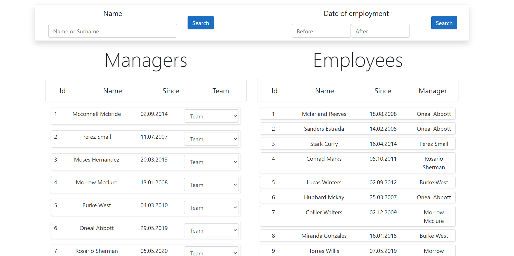
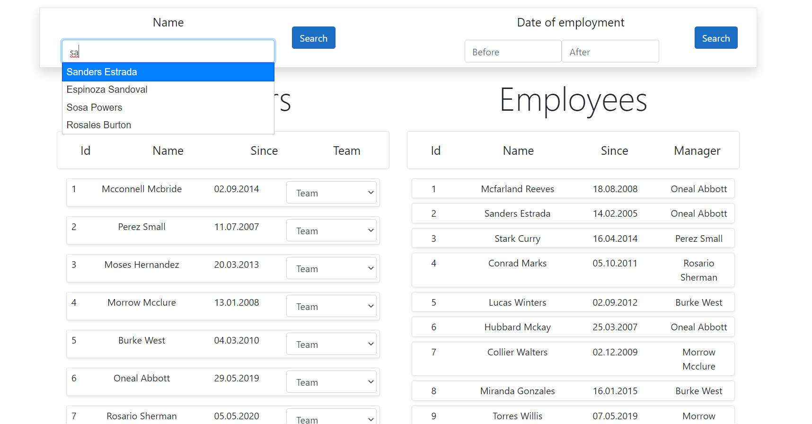
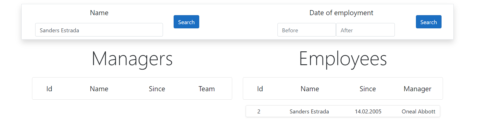
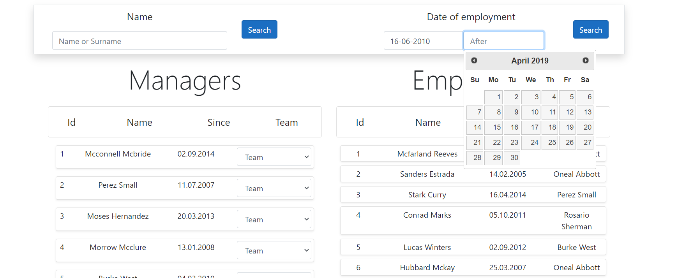
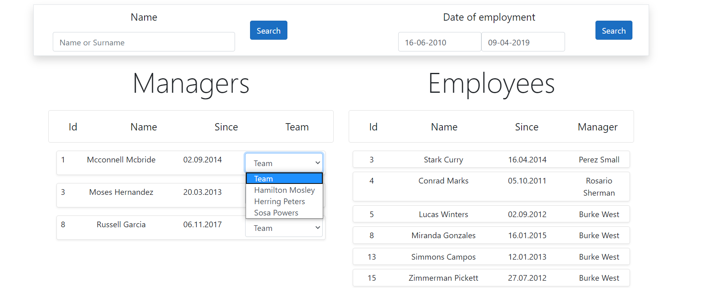

# ApplicationToKPMG

Aplikacja w której automatycznie generowane są pliki bazy danych (gdy baza jest pusta). W aplikacji możemy wyszukiwać pracowników, menagerów po nazwię oraz po dacie zatrudnienia. U każdego pracownika widzimy obok jego menagera, jak i u każdego menagera widzimy jego team.

## Technologies

Asp.net Core MVC

Razor Pages

Jquery/Ajax

Bootstrap

MSSQL Server

## Installation

Potrzebne programy do uruchomienia projektu:

Visual studio 2019 

W folderze z plikami właczamy wiersz poleceń git i wpisujemy:
git clone https://github.com/dominik852321/ApplicationToKPMG

Po instalacji wchodzimy w folder, klikamy i uruchamiamy w programie Visual studio 2019 HomeworkFromKPMG.csproj

## Contribute
* Source Code: https://github.com/dominik852321/ApplicationToKPMG

## ScreenShots
Oto główne okno aplikacji

Możemy wyszukać pracowników, pomaga nam w tym technologia ajax

Widzimy efekt

Możemy wyszukiwać pracowników na podstawie daty zatrudnienia. (Przed datą, po tej dacie lub pomiędzy).

W tym miejscu znajduję się team pod danym menagerem.

## Author

Dominik Orzechowski

